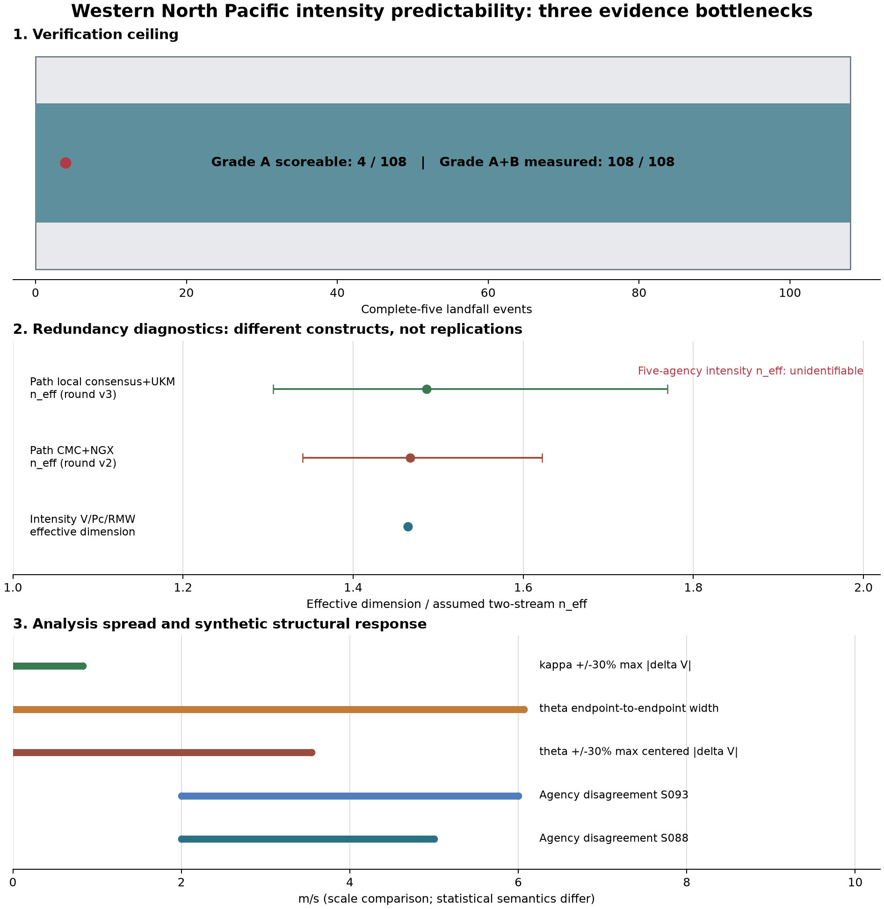

# 西北太平洋强度可预报性的三重天花板

状态：`cross-project-evidence-synthesis`；预报资格：`unvalidated`。

本报告中的“天花板”指当前公开数据与本项目实现暴露出的三类证据瓶颈，
其语义不是大气内在可预报性的定理上界。全文只整合已冻结的历史测量和合成结构审计，
没有生成巴威或任何现实台风的强度预测。

## 这轮做成了什么

1. [MEASURED] 108 次五家齐全登陆中，独立测站/雷达真值覆盖为 `0/108`；
   五家真实 MAE、RMSE 与真误差相关保持不可识别。
2. [ASSUMED→MEASURED] 五家强度统一到 10 分钟平均窗后，成对分歧为
   `2--5 m/s`（JTWC 乘 0.88）和 `2--6 m/s`（JTWC 乘 0.93）。
3. [MEASURED] 五家强度 `n_eff` 在留一偏差构造下不可识别；
   `1.46、1.47、1.46 是三次独立复现` 这一旧说法正式撤回。
4. [ASSUMED→MEASURED] 可识别组合 `theta=Ck/h` 的 `[0.7,1.3]` 61 点情景已传播到
   48 h 最终风速：三个合成场景最大单侧变化 `3.54 m/s`，最大端点宽度
   `6.07 m/s`。
5. [MEASURED] `3.54 m/s` 与机构分歧 `2--6 m/s` 位于同一数量级。
   前者是合成参数响应，后者是历史机构分析差；两者的统计语义独立保留。



## 第一重：真值天花板

### 测得了什么

- [MEASURED] IBTrACS 首次海→陆穿越共识别 368 次；五家原始强度均可插值的登陆为
  108 次。
- [MEASURED] NCEI 最终输入包中可与这 108 次事件配对的西北太平洋独立测站、
  风速仪或雷达中心最大风记录为 0 次。
- [MEASURED] 五家独立真值覆盖率均为 0%；真实 bias、MAE、RMSE、误差 SD 和
  误差相关矩阵的状态统一为 `unidentifiable_zero_independent_truth_coverage`。

### 能支持的结论

IBTrACS 可以测量五家彼此相差多少，也可以测量它们相对 CMA 分析场的代理差。
它无法识别五家共同偏离真实中心最大风的幅度。CMA 代理差还共享同一个参照项，
且 CMA 可吸收中国测站信息，具有主场优势。

这一重限制的是**绝对准确性验证**。当前项目可报告机构一致性，真实登陆误差排名的
证据资格为零。

## 第二重：信息冗余天花板

### 五机构强度分歧

[ASSUMED→MEASURED] 所有风速先归一到 10 分钟平均窗。JMA、HKO、KMA 原生为
10 分钟，CMA 原生为 2 分钟并采用 0.96 主系数，JTWC 原生为 1 分钟并运行
0.88 与 0.93 两个情景。

|情景|完整时次/台风|最小成对 SD|最大成对 SD|解释|
|---|---:|---:|---:|---|
|JTWC × 0.88|4,234 / 232|2 m/s|5 m/s|[MEASURED] CMA-HKO 最小，JTWC-KMA 最大|
|JTWC × 0.93|4,234 / 232|2 m/s|6 m/s|[MEASURED] CMA-HKO 最小，JTWC-KMA 最大|

[MEASURED] 这些 SD 的统计独立单位按台风聚类；Kish 有效台风数为 162。
这个范围描述机构分析的一致性，也包含风窗转换假设造成的尺度变化。

### 五机构 `n_eff` 的正式判决

[ASSUMED] 预注册公式为：

```text
n_eff = 5 / (1 + 4*rho_bar)
d_i = V_i - mean(V_-i)
```

[MEASURED] 五个留一偏差在每个时次严格满足 `sum(d_i)=0`。这个代数约束机械地产生
负相关，使 22 个风窗情景的公式点值落在 `49--146`，超过五家意见的解释上限 5。
因此有限五机构强度 `n_eff` 的状态是 `unidentifiable`。

这个数字衡量一致性，不衡量准确性。当前构造也没有提供一个可解释为“五家相当于
几家独立意见”的有限答案。

### `1.46/1.47/1.46` 纠错

旧说法“约 1.46 得到三次独立复现”混合了不同统计对象，并重复引用了同一份审计。
正确账本如下：

|数值|对象|样本|统计定义|资格|
|---:|---|---:|---|---|
|1.46|JTWC 的 `V/Pc/RMW`|16,225 条、660 个台风|[MEASURED] 三通道相关矩阵的 participation ratio|没有聚类 CI；它是观测通道有效维数|
|1.47 [1.34, 1.62]|CMC 与 NGX 路径误差|1,203 条、26 个台风|[ASSUMED→MEASURED] 两误差流交换相关 `n_eff`|路径构念；round v2|
|1.49 [1.31, 1.77]|本地 CMC/NGX 共识与 UKM 路径误差|552 条、17 个台风|[ASSUMED→MEASURED] 两误差流交换相关 `n_eff`|路径构念；round v3|

[MEASURED] round v3 同样本的 `Delta n_eff=+0.07`，95% CI
`[-0.20,+0.40]`。当前样本无法分辨独立 UKMET 核心带来的有效意见增量。
round v2 与 v3 的路径样本存在重叠；两处 `1.46` 原引用来自同一份观测审计。

这三项共同提示信息冗余广泛存在。它们的构念、样本和公式不同，独立重复证据数为 0。

## 第三重：结构参数天花板

### 可识别参数组合

[CITED] FAST 上游实现给出 `Ck=1.2e-3`、西北太平洋边界层深度
`h=1800 m`、`kappa=0.10`。连续核心的风速与水汽倾向包含前因子：

```text
0.5 * Ck * surface_exchange_multiplier / h
```

[MEASURED] `Ck` 与 `h` 同比缩放时，完整轨迹最大原生状态差为
`2.55e-11`，低于预注册容差 `1e-8`。当前方程只识别组合
`theta=Ck/h`；二者分解存在 1 个不可识别自由度。

### 传播到 48 h 最终风速

[ASSUMED] `theta/theta_0` 取 `[0.7,1.3]` 的 61 点有界情景；区间只承担
压力测试，没有概率分布和 95% 区间语义。三个强迫序列均为冻结合成场景，
regime 日程固定。

|合成场景|0.7 theta0 终值|theta0 终值|1.3 theta0 终值|max abs delta|端点宽度|
|---|---:|---:|---:|---:|---:|
|开放海洋增强|45.61|47.58|48.36|1.97|2.76|
|恶劣开放海洋|22.65|19.11|16.59|3.54|6.07|
|登陆过渡|19.00|15.72|13.42|3.28|5.58|

[MEASURED] 单位均为 m/s。`Ck` 缩放与等价 `h` 反向缩放的完整轨迹最大差为
`3.55e-15`，确认 61 点结果沿同一个可识别结构方向传播。

### 三个常量的 ±30% 压力测试

|常量扰动|三个合成场景最大 48 h abs(delta V)|证据语义|
|---|---:|---|
|`Ck -30% / +30%`|3.54 / 2.53 m/s|[MEASURED] 固定 regime 数值响应|
|`h -30% / +30%`|3.41 / 2.60 m/s|[MEASURED] 固定 regime 数值响应|
|`kappa -30% / +30%`|0.77 / 0.83 m/s|[MEASURED] 固定 regime 数值响应|

[MEASURED] `theta` 最大单侧响应 3.54 m/s 落在机构成对分歧 2--6 m/s 内，
最大端点宽度 6.07 m/s 接近该历史分歧上沿。这个比较只说明数量级相近。
机构 SD、合成响应和概率误差之间没有可用的方差合并关系。

## 三把刀自检

1. **状态向量里有什么？**
   机构测量使用每时次五家 10 分钟风速；观测审计使用 `(V,Pc,RMW)`；
   合成动力核心使用 `X=(V,m,Pc,RMW)`，regime 作为冻结日程。
2. **参数几个、独立观测几个？**
   真值审计拟合参数 0、独立登陆真值 0/108；五机构分歧拟合参数 0、
   `n_eff` 公式含一个交换相关假设；结构传播拟合参数 0、扫描 1 个可识别组合
   `theta`，现实独立观测数为 0。
3. **拿什么数据证伪？**
   事件级测站/雷达中心最大风可打开第一重闸门；预注册且不受零和约束的误差模型
   可重新检验五机构 `n_eff`；密封历史预报与独立登陆真值可检验结构敏感度能否解释
   现实终值误差。

## 偏离与纪律

- [MEASURED] 本综合包没有新增拟合、阈值搜索或预测；它直接读取已冻结的上游产物。
- [MEASURED] 三联图在上游结果完成后设计，只承担描述性汇总，没有 inferential
  判决功能。
- [MEASURED] “三次独立复现”旧结论已撤回；机器可读结果把纠错状态固定为
  `retracted`。
- [MEASURED] 所有数字保留 `[MEASURED] / [ASSUMED] / [CITED]` 来源语义；
  图的三个面板使用独立坐标与独立解释。

## 来源与复现

- [五机构强度分歧报告](ibtracs-agency-disagreement/report.md)
- [登陆独立真值审计](ibtracs-agency-disagreement/report_b_branch.md)
- [路径 UKMET 独立核心审计](path-track-benchmark/report_round_v3.md)
- [`theta` 终值传播报告](markov/report_theta_propagation.md)
- [FAST 固定常量审计](markov/report_global_sensitivity.md)
- [CITED] [NOAA/NCEI IBTrACS](https://www.ncei.noaa.gov/products/international-best-track-archive)
- [CITED] [Lin et al. (2023), JAMES](https://doi.org/10.1029/2023MS003686)

[MEASURED] 证据构建代码 Git `2349b0f9532a238debc23f93a053c53fd6797c4d`。
机器可读产物位于 `outputs/intensity_predictability_ceilings/synthesis.json`；
`manifest.json` 保存输入与输出哈希。

复现：

```bash
cd "/Users/taozhe/Documents/New project/typhoon"
markov/.venv/bin/python scripts/build_intensity_predictability_ceilings.py
markov/.venv/bin/python scripts/build_intensity_predictability_ceilings.py --check
```

## 缺口与下一步

- 第一优先级数据仍是事件级独立测站/雷达表：位置、时刻、平均窗、持续风、质量标志。
- 五机构强度有效意见数需要一个摆脱留一零和约束、且拥有独立误差目标的预注册设计。
- `theta` 情景边界需要独立通量或边界层观测形成统计分布；当前 `+/-30%` 只是一把压力尺。
- Markov v0.1 的 `regime -> V` 作用仍为 0；真实结构预测继续由微波径向观测与密封
  Brier 检验承担闸门。
