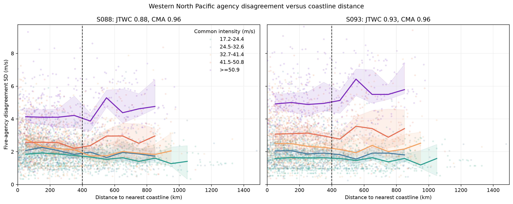

# IBTrACS 西北太平洋五机构强度分歧测量

生成时间：2026-07-12T15:58:01.902227+00:00
范围：JTWC、JMA、CMA、HKO、KMA；名义期 2001–2024，complete-five 实际支持期 2015–2024；10 m、10 分钟、m/s。
研究性质：历史机构分析的一致性测量。模型构建与巴威预测均未进入流程。

## 判决置顶

1. **有限 `n_eff` 被预注册闸门判为不可识别。** 留一偏差严格零和，换算敏感性给出的代数点值为 49–146，超过五家意见的解释上限；交换相关解释在该构造下失效。
2. **登陆真值误差相关由 IBTrACS 单独无法识别。** 当前字段缺少独立测站风、测站位置、观测时刻和平均窗；CMA 参考差只提供循环参照下的描述。
3. **核心近岸检验：** S088 分歧在靠岸过程中增大；S093 分歧在靠岸过程中增大。

该数据测得机构彼此有多像；共同偏离真实强度的程度需要独立观测真值。

## 数据与口径

- [MEASURED] 当前文件筛选后含 43,655 条 6 小时时次、1,218 个 SID。
- [MEASURED] Natural Earth 海岸点最大间距为 5 km；200 点验证的 P95 绝对误差为 2.8 km。
- [MEASURED] 台湾掩膜检查 `121°E/23.5°N`：`True`。全球陆地统一进入计算。
- [CITED] Natural Earth 当前下载包版本：coastline `5.0.0-pre9`，land `5.1.1`。海岸距离验证量化 coastline 加密误差；版本差异保留在 provenance。
- [MEASURED] 当前 IBTrACS v04r01 西北太平洋 CSV 缺少 CWA/CWB 原生列；第五家依预先登记的 D001 使用 KMA。

|机构|IBTrACS 列|原生平均窗|目标平均窗|乘数|状态/来源|
|---|---|---:|---:|---:|---|
|JTWC|USA_WIND|1 min|10 min|0.88 / 0.93|[ASSUMED/CITED] 传统情景 / WMO 海上 Vmax 建议|
|JMA|TOKYO_WIND|10 min|10 min|1.00|[CITED] IBTrACS 字段文档|
|CMA|CMA_WIND|2 min|10 min|0.96；0.90–1.00 敏感性|[ASSUMED+CITED] WES 2026 表 4；方法不确定性由网格覆盖|
|HKO|HKO_WIND|10 min|10 min|1.00|[CITED] IBTrACS 字段文档|
|KMA|KMA_WIND|10 min|10 min|1.00|[CITED] IBTrACS 字段文档|

WMO/TD-No.1555 对机构 `Vmax` 明确建议海上 1 分钟→10 分钟取 0.93，并把 0.88 归为传统/近岸暴露量级。CMA 的 0.96 来自同行评议论文对 WMO 阵风因子的应用；WMO 原文同时强调随机平均风与峰值阵风的转换语义差异。因此 0.96 作为显式假设使用，完整 0.90–1.00 网格承担敏感性。

## A. 成对分歧

### S088：JTWC 系数 0.88

[MEASURED] `sd(V_i−V_j)`，m/s；4,234 条记录、232 个台风，Kish 有效台风数 162；实际日期 2015–2024。展示值按要求取整数。

| | JTWC | JMA | CMA | HKO | KMA |
|---|---:|---:|---:|---:|---:|
| JTWC | 0 | 5 | 4 | 4 | 5 |
| JMA | 5 | 0 | 3 | 4 | 3 |
| CMA | 4 | 3 | 0 | 2 | 3 |
| HKO | 4 | 4 | 2 | 0 | 4 |
| KMA | 5 | 3 | 3 | 4 | 0 |

[MEASURED] 最小成对分歧为 CMA-HKO：2 m/s，台风聚类 95% CI 2–3 m/s；最大为 JTWC-KMA：5 m/s，95% CI 5–5 m/s。
[ASSUMED→MEASURED] CMA 0.90–1.00 网格使这两项分别覆盖 2–3 与 5–5 m/s。

### S093：JTWC 系数 0.93

[MEASURED] `sd(V_i−V_j)`，m/s；4,234 条记录、232 个台风，Kish 有效台风数 162；实际日期 2015–2024。展示值按要求取整数。

| | JTWC | JMA | CMA | HKO | KMA |
|---|---:|---:|---:|---:|---:|
| JTWC | 0 | 5 | 4 | 4 | 6 |
| JMA | 5 | 0 | 3 | 4 | 3 |
| CMA | 4 | 3 | 0 | 2 | 3 |
| HKO | 4 | 4 | 2 | 0 | 4 |
| KMA | 6 | 3 | 3 | 4 | 0 |

[MEASURED] 最小成对分歧为 CMA-HKO：2 m/s，台风聚类 95% CI 2–3 m/s；最大为 JTWC-KMA：6 m/s，95% CI 5–6 m/s。
[ASSUMED→MEASURED] CMA 0.90–1.00 网格使这两项分别覆盖 2–3 与 6–6 m/s。

两份完整聚类区间、CMA 网格包络、逐对可用样本矩阵存于 `outputs/pairwise_disagreement_intervals.json`。

## B. 去共同信号相关与 n_eff

[ASSUMED] 公式采用五通道交换相关结构：`n_eff = 5/(1+4ρ̄)`。每个时次先计算 `d_i = V_i − mean(V_-i)`，再在 `d_i` 上求相关；原始风速相关仅作为共同生消信号诊断。

|情景|ρ̄（95% CI）|分母（95% CI）|n_eff（95% CI）|闸门|
|---|---:|---:|---:|---|
|S088|-0.24 (-0.24, -0.24)|0.045 (0.037, 0.055)|110.1 (91.5, 133.7)|有限值不可识别|
|S093|-0.23 (-0.23, -0.23)|0.078 (0.066, 0.091)|64.2 (54.8, 76.0)|有限值不可识别|

[MEASURED] 留一偏差满足 `Σd_i=0`，它会机械地产生负相关并把分母推向零。原始风速的平均相关为 0.97，该高值主要反映共同生消信号，未进入公式。全敏感性 `ρ̄` 为 -0.24–-0.22。该数字只衡量意见一致性；准确性需要独立真值。全部 22 个风窗情景见 `outputs/neff_sensitivity.json`。

## 核心检验：分歧与离岸距离

[ASSUMED] 因变量为 `log1p(SD/共同中位强度)`；控制强度层、年代层、生消阶段；台风为 2,000 次 cluster bootstrap 单位。正的近岸段斜率表示向外海移动时分歧增加。

|情景|记录/台风/Kish|未调整近岸斜率 95% CI|调整后近岸斜率 95% CI|斜率变化 95% CI|ΔAIC|判决|
|---|---:|---:|---:|---:|---:|---|
|S088|3591/225/147|-0.0022 (-0.0037, -0.0007)|-0.0017 (-0.0031, -0.0003)|0.0014 (-0.0010, 0.0038)|-1.6|分歧在靠岸过程中增大|
|S093|3591/225/147|-0.0015 (-0.0031, 0.0000)|-0.0017 (-0.0032, -0.0003)|0.0019 (-0.0006, 0.0044)|-5.0|分歧在靠岸过程中增大|

[MEASURED] 两种情景的调整后近岸斜率 95% CI 均位于零以下，方向在 CMA 0.90–1.00 网格、至少三家样本和台风内回归中保持。两种情景的斜率变化 95% CI 均跨零；S088 的 ΔAIC 也未达到 −2，因此 400 km 折点缺少预注册支持。

### 强度分层

[MEASURED] 调整后近岸段斜率（每 100 km，95% 台风聚类 CI）：

|共同强度层 m/s|S088|S093|
|---|---:|---:|
|17.2-24.4|-0.0007 (-0.0030, 0.0016)|-0.0005 (-0.0028, 0.0019)|
|24.5-32.6|-0.0010 (-0.0041, 0.0022)|-0.0016 (-0.0046, 0.0017)|
|32.7-41.4|-0.0040 (-0.0072, -0.0004)|-0.0036 (-0.0069, -0.0004)|
|41.5-50.8|-0.0009 (-0.0033, 0.0014)|-0.0011 (-0.0043, 0.0019)|
|>=50.9|-0.0004 (-0.0027, 0.0019)|0.0004 (-0.0019, 0.0028)|

只有 32.7–41.4 m/s 层在两种口径下均排除零；其余强度层证据区间跨零。整体反向关联具有稳健方向，强度层间普遍性仍受区间限制。

强度分层、300/350/450/500 km 折点、CMA 网格、1987–2024、全部性质、插值标志、至少三家及台风内固定效应结果均在 `outputs/coast_effect.json`。

## 缺测审计

[MEASURED] 候选时次 11,205 条；五家原始值齐全率 37.8%。

|机构|原始风速可用率|
|---|---:|
|JTWC|95.3%|
|JMA|97.2%|
|CMA|99.7%|
|HKO|97.9%|
|KMA|39.5%|

[MEASURED] KMA 覆盖率最低，complete-five 样本由覆盖交集决定。完整样本的海岸距离中位数为 240 km；不完整样本为 259 km。逐年代、强度和距离缺测表见 `outputs/missingness.json`。
[MEASURED] complete-five 样本在 2000–2009 年为零；2010–2019 占 57.5%，2020–2024 占 42.5%；最早完整记录出现在 2015 年。因此主矩阵与核心检验的历史支持范围为 2015–2024，年代外推受到 KMA 缺测限制。

## 登陆子集

[MEASURED] S093 识别首次海→陆穿越 368 个，其中五家原始值可线性插值的登陆 108 个。
[MEASURED] 独立测站真值字段数为 0，因此各机构登陆真值误差与误差相关矩阵保持不可识别状态。
[ASSUMED] CMA 参考差带有主场优势：CMA 分析可吸收中国测站信息；所有 `agency−CMA` 项共享 CMA 参照，相关性也带共享项。

|机构|S088 相对 CMA 平均差，m/s（95% CI）|S093 相对 CMA 平均差，m/s（95% CI）|S093 差值 SD，m/s|
|---|---:|---:|---:|
|JTWC|-1 (-2, -1)|0 (0, 1)|4|
|JMA|-1 (-1, 0)|-1 (-1, 0)|4|
|HKO|1 (1, 2)|1 (1, 2)|3|
|KMA|-1 (-2, 0)|-1 (-2, 0)|4|

[MEASURED] S093 的 CMA 参考差相关矩阵（点估计，完整台风登陆）：

| |JTWC|JMA|HKO|KMA|
|---|---:|---:|---:|---:|
|JTWC|1.00|-0.05|0.41|-0.05|
|JMA|-0.05|1.00|0.15|0.69|
|HKO|0.41|0.15|1.00|0.31|
|KMA|-0.05|0.69|0.31|1.00|

这些量是 CMA 参考差，具有描述性；共享 CMA 项会直接影响相关。真实误差需要独立测站序列及统一平均窗。

## 七个陷阱回应

1. **平均窗：** 每家原生窗、目标窗和乘数均打印；JTWC 双情景与 CMA 网格完整保留。
2. **尺度与相关：** 成对 SD 在每个换算情景重算；相关性结果单独处理。
3. **共同信号：** `n_eff` 使用留一偏差相关；原始风速相关只作诊断。
4. **自相关：** 全部 95% CI 以 SID 为 cluster 做 2,000 次 bootstrap；同时报告 SID 与 Kish 有效台风数。
5. **混淆：** 核心检验控制共同强度、年代、生消阶段，并补充台风内估计和强度分层。
6. **缺测：** 原始值、机构插值标志、年代/强度/距离缺测模式及至少三家敏感性均显式输出。
7. **独立真值：** 西北太平洋常规飞机侦察于 1987 年结束；此后机构分析共享以卫星为主的信息体系。共同误差由该数据无法分离，登陆字段审计同样缺少独立测站真值。

## 假设、测量与引用

- [MEASURED] 矩阵、相关、回归、距离、缺测和登陆穿越均由本次固定代码计算。
- [ASSUMED] 风窗换算、交换相关公式、17.2 m/s 阈值、400 km 折点和线性控制形式。
- [CITED] [NOAA/NCEI IBTrACS](https://www.ncei.noaa.gov/products/international-best-track-archive)、[IBTrACS v04r01 字段文档](https://www.ncei.noaa.gov/sites/default/files/2025-09/IBTrACS_v04r01_column_documentation.pdf)、[CMA 的 2 分钟定义](https://www.cma.gov.cn/wmhd/gzly/cjwt/202311/t20231127_5912128.html)、[WMO/TD-No.1555](https://systemsengineeringaustralia.com.au/download/WMO_TC_Wind_Averaging_27_Aug_2010.pdf)、[WES 2026 换算表](https://doi.org/10.5194/wes-11-1889-2026)、[Knapp 等 2013 对 1987 年后地面真值缺口的审计](https://doi.org/10.1175/MWR-D-12-00323.1)、[Natural Earth 1:10m coastline](https://www.naturalearthdata.com/downloads/10m-physical-vectors/10m-coastline/)。

## 预注册偏离

完整记录见 `deviations.md`：D001 将缺席的 CWA/CWB 列替换为 KMA；D002 主分析使用原始强度标志；D003 主分析限定 `NATURE=TS`。三项均在首次统计结果之前登记。
