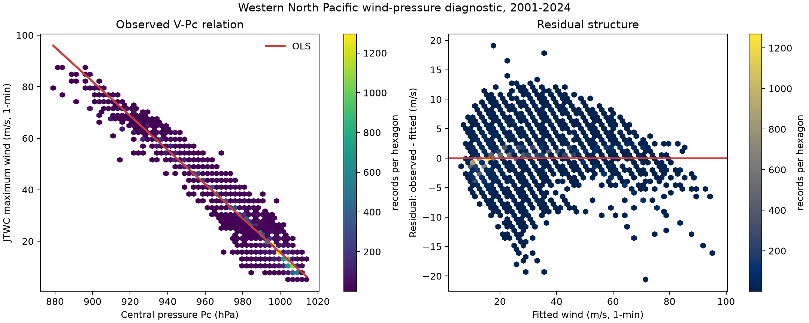

# 支线 B：登陆强度与风压诊断

冻结协议：[`b_branch_protocol.md`](b_branch_protocol.md)

状态：`research-measured`；密封业务回报检验尚未完成，未使用 `validated` 标签。

## 这轮做成了什么

1. **[验证过][MEASURED] 外部登陆观测审计已接入。** IBTrACS 包内独立测站/雷达真值为
   `0/108`；包外公开档案采得 16289 条 A/B 级仪器记录，A+B 事件覆盖为
   `108/108`，严格 A 级可评分覆盖为 `4/108`。
   五家对这 4 案的 MAE、RMSE 与真误差相关状态为 `measured_against_external_grade_a_truth`。
2. **[MEASURED] NCEI 最终输入包审计保持独立。** 输入包共
   14358 个文件；文件名审计得到 0 个测站、风速仪或雷达候选。
   全文词项审计在其他海盆来源中检出 14 个含相关叙述的文件，
   CMA/HKO/JTWC/KMA/Tokyo 西北太平洋来源目录命中 0 个。
   2015--2024 CMA 年度原始文件有 9013 条最佳路径记录，
   `OWD` 有值记录为 0。
   这一结果证伪“IBTrACS 最终输入包本身足以计算五家登陆真值误差”。
3. **[MEASURED+ASSUMED] CMA 参照代理表已经发布。** 该表衡量各机构与 CMA 登陆分析的差，
   CMA 会吸收中国测站资料，具有主场优势；代理差共享同一个 CMA 参照项。
4. **[MEASURED] 风压关系已固化为可复用模块。** 主样本含 18707 条记录、
   672 个台风；JTWC 风速保持原生 1 分钟窗口，气压单位为 hPa。
5. **[MEASURED] Pc-only 五折留出台风检验已经完成。** 每个台风只属于一个折，误差区间按台风
   block bootstrap 2,000 次。

## B1 登陆强度真值审计

外部真值表位于 `outputs/b_branch/landfall_truth.csv`，逐事件来源状态位于
`landfall_truth_source_event_status.csv`，五家评分表位于
`independent_truth_error_table.csv`。本轮 A 级为 `4/108`，A+B 为
`108/108`。B 级测站风承担覆盖证据，严格 A 级承担机构误差评分。

[验证过] 当前五家评分状态为 `measured_against_external_grade_a_truth`。完整来源、平均窗、最大风区证据和访问门槛
见 [`landfall_truth_report.md`](landfall_truth_report.md)。

误差定义为 `agency_10min - external_truth_10min`，单位 m/s；括号为按 SID bootstrap
2,000 次的 95% CI。

|机构|A 级事件|bias|MAE|RMSE|
|---|---:|---:|---:|---:|
|JTWC|4|12.6 [9.1, 18.5]|12.6 [9.1, 18.5]|13.6 [9.1, 19.1]|
|JMA|4|6.0 [3.7, 9.5]|6.0 [3.7, 9.5]|6.8 [3.7, 10.1]|
|CMA|4|7.9 [3.2, 13.9]|7.9 [3.2, 13.9]|9.5 [3.8, 14.6]|
|HKO|4|12.4 [9.3, 17.6]|12.4 [9.3, 17.6]|13.2 [9.3, 18.2]|
|KMA|4|6.3 [2.7, 9.9]|6.3 [2.7, 9.9]|7.4 [2.7, 10.1]|

[验证过][MEASURED] A 级真误差相关点值和区间位于
`independent_truth_error_correlation.csv` 与
`independent_truth_error_correlation_intervals.csv`。当前 4 案全部来自台湾，多数非对角
相关区间覆盖 `[-1, 1]`；矩阵承担 4 案描述，长期相关仍需扩充 A 级事件。

### Tier 3：CMA 分析参照

单位均为 m/s，点估计后括号为按台风聚类 95% CI。五家风速已经归一到 10 分钟：JTWC
采用 1 分钟到 10 分钟系数 0.93，CMA 采用冻结的 2 分钟到 10 分钟系数 0.96；JMA、HKO、
KMA 原生为 10 分钟。

|机构|均值差|MAE|RMSE|差值 SD|解释|
|---|---:|---:|---:|---:|---|
|JTWC|0 [0, 1]|3 [2, 3]|4 [3, 4]|4 [3, 4]|CMA 代理差|
|JMA|-1 [-1, 0]|3 [2, 3]|4 [3, 4]|4 [3, 4]|CMA 代理差|
|CMA|0 [0, 0]|0 [0, 0]|0 [0, 0]|0 [0, 0]|自参照恒等式|
|HKO|1 [1, 2]|2 [2, 3]|3 [3, 4]|3 [2, 3]|CMA 代理差|
|KMA|-1 [-2, 0]|3 [3, 4]|4 [4, 5]|4 [4, 5]|CMA 代理差|

[MEASURED+ASSUMED] 代理误差相关矩阵及其聚类 95% CI 位于
`landfall_cma_reference_correlation_*.csv`。CMA 自参照误差恒为 0，其相关系数按定义写作 NA。
这个矩阵描述共同 CMA 参照下的联动，无法识别五家共同偏差。

## B2 风压关系诊断

[ASSUMED] 冻结线性式为 `V_1min = alpha + beta * (1010 - Pc)`；含 2 个拟合参数。

- [MEASURED] `alpha = 8.95` m/s，95% CI
  [8.72, 9.16]。
- [MEASURED] `beta = 0.66` m/s/hPa，95% CI
  [0.66, 0.67]。
- [MEASURED] `corr(V, Pc) = -0.98`，台风聚类 95% CI
  [-0.98, -0.98]。
- [MEASURED] 回归残差尺度为 3 m/s，95% CI
  [3, 3]。
- [MEASURED] 逆式 `Pc = 1022.09 - 1.45 * V_1min`。

[MEASURED] legacy `V/Pc/RMW` 三字段齐全样本含 16225 条记录；复算相关为
-0.9817357764，与旧值 -0.9817357764 的差为 -2.55e-15。
旧技术债数字得到精确复现，同时主回归保持独立的预注册筛选。

## B3 Pc 单独反推 V

|方法|MAE m/s|RMSE m/s|bias m/s|残差 SD m/s|P80/P95 绝对误差 m/s|
|---|---:|---:|---:|---:|---:|
|Pc-only 五折|2|3|0|3|3/7|
|训练集均值基线|13|17|0|17|18/36|

- [MEASURED] Pc-only RMSE 的台风聚类 95% CI 为
  [3, 3] m/s。
- [ASSUMED+MEASURED] 相对训练均值基线的交叉验证方差削减为
  96%，95% CI
  [96%,
  97%]。

Pc 对 V 具有很强的可替代信息。V 与 Pc 来自同一事后分析体系，高相关主要体现风压物理关系
和联合分析约束。增加 Pc 对独立准确性的增益需要独立观测误差模型；本数据无法识别该量。

## 三把刀

1. **状态向量。** 本支线是测量诊断，记录向量为 `(V_1min, Pc)`；登陆表由五家 10 分钟
   归一风速和真值等级字段构成。
2. **参数与独立观测。** 风压回归含 2 个系数；统计独立单位按台风聚类。登陆观测 A+B 覆盖为
   108/108，A 级可评分覆盖为 4/108；机构绝对误差资格由 A 级闸门控制。
3. **证伪数据。** 完整元数据测站/雷达记录用于证伪登陆分析；留出台风的 JTWC `V_1min`
   用于证伪 Pc-only 关系。系数区间与留出 MSE 均按冻结规则判决。

## 预注册偏离

- [MEASURED] D004 已在计算前登记。源包现代 CMA 文件的 `OWD` 覆盖为 0，因此 Tier 2
  事件级匹配自然终止。B2/B3 选择、随机种子、折数和 bootstrap 次数均按协议执行。
- [MEASURED] D005 在第一次正式运行后登记。旧 `-0.9817` 属于
  `V/Pc/RMW complete + USA_AGENCY=jtwc_wp` 的 16,225 条子集；33,308 条全机构完整样本的
  原始旧值为 `-0.9789`。代码现同时记录两种样本规模，并按旧 JSON 的子集原名复现目标数字。

## 缺口与下一步

- A 级登陆真误差需要眼墙/最大风区证据与可比 10 分钟持续风；现有 16285 条 B 级记录
  已提供 ID、位置、时刻或影响期、平均窗口与质量字段。
- 点测站阵风、沿岸 2 分钟大风和台风中心最大持续风具有不同观测算子；未来数据接入需保留三者语义。
- 风压式属于统计诊断；密封年代外检验和独立观测误差建模完成前，状态保持 `research-measured`。

## 来源

- [CITED] [NOAA/NCEI IBTrACS 产品页](https://www.ncei.noaa.gov/products/international-best-track-archive)
- [CITED] [IBTrACS v04r01 字段文档](https://www.ncei.noaa.gov/sites/default/files/2025-09/IBTrACS_v04r01_column_documentation.pdf)
- [CITED] [CMA 热带气旋等级国家标准说明](https://www.cma.gov.cn/wmhd/gzly/cjwt/202311/t20231127_5912128.html)
