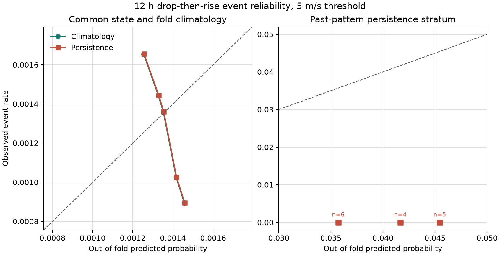
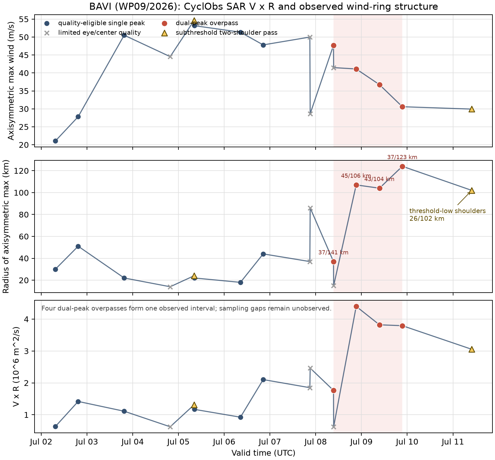

# 支线 C 历史审计

> **2026-07-15 项目宪法修订：**
> C-代理输出未来 24 h 减弱-再增强强度波形概率，并接受 Brier 与可靠性评分。
> C-结构按可观测时段输出双环结构的确证、存疑或无覆盖裁决。
> 本历史报告中的两类材料从此按上述独立语义读取。

状态：`research-baseline`。生成日期：2026-07-15。预注册见 [c-branch-preregistration.md](docs/c-branch-preregistration.md)。

> **2026-07-15 证据纠错：** 本报告旧版把连续 SAR 双环观测时段外推为对巴威 ERC 数量的否定。该物理外推已撤回。最新一手裁决为“7 月 8--9 日确证；7 月 4 日存疑；7 月 7 日存疑”；TC PRIMED WP09 裁决为“无覆盖”。详见 [一手覆盖纠错报告](report_c_coverage_correction.md)。

## 这轮做成了什么

1. [MEASURED] 从 IBTrACS 2001-2024 西北太平洋序列生成 12,190 个完整五点窗口，覆盖 631 个风暴；全部标签由 1 分钟 `USA_WIND` 自动计算。
2. [MEASURED] 5 m/s 主阈值产生 16 个未来 12 小时“先降后升”事件，涉及 16 个风暴。
3. [MEASURED] 完成风暴分组五折的气候概率与持续性概率基线，并用 2,000 次风暴整块 bootstrap 给出 Brier 区间和可靠性图。
4. [MEASURED] 找回并确定性解析 Kuo et al. (2009) 的 62 行西北太平洋同心眼墙形成表，覆盖 55 个独立热带气旋。
5. [MEASURED] 完成巴威 16 景 CyclObs SAR 的 `V·R` 时序；12 景通过眼区与中心质量门槛，4 景满足探索性双峰阈值。覆盖纠错将 7 月 8--9 日裁决为“确证”，巴威物理 ERC 周期数保持不可判定。

## 最先报告的否定结果

- [MEASURED] **持续性概率基线被主检验否定。** 气候基线 Brier 为 `0.001311`，持续性为 `0.001313`；配对差值为 `+0.00000204`，风暴聚类 95% CI `[+0.00000111,+0.00000309]`。Brier 越低越好。
- [MEASURED] **巴威 7 月 8--9 日可观测时段裁决为“确证”。** 四个双峰过境集中在 7 月 8 日 09:19 UTC 至 7 月 9 日 21:27 UTC。7 月 4 日景缺少眼区，裁决为“存疑”。7 月 7 日两景未通过结构质量门槛，裁决为“存疑”。
- [MEASURED] **预注册资源范围内找到可复用的 WNP CE formation 表，逐行 WNP ERC-onset 真值表仍为空缺。** Kuo 表可直接用于同心眼墙形成研究；ERC onset 与完成时刻需要另一类标签。

## 1. 自动事件测量

### 1.1 标签口径

- [CITED] 数据为 [NOAA/NCEI IBTrACS v04r01](https://www.ncei.noaa.gov/products/international-best-track-archive)。
- [MEASURED] 强度字段为 `USA_WIND`，筛选 `USA_AGENCY=jtwc_wp`；平均窗口为 1 分钟，单位从 kt 按 `0.514444 m/s` 转换。
- [ASSUMED] 主事件要求 `t→t+6 h` 下降至少 5 m/s，且 `t+6→t+12 h` 回升至少 5 m/s。
- [MEASURED] JTWC 的 5 kt 量化使主事件在本样本中实际要求每段至少 10 kt，即 5.14 m/s。
- [MEASURED] 标签描述 post-season best-track 强度波形；物理原因字段保持空值。

### 1.2 基准率与阈值敏感性

| 样本 | 阈值 | 窗口 | 风暴 | 事件 | 行发生率，风暴聚类 95% CI |
|---|---:|---:|---:|---:|---:|
| 全部热带阶段 | 2.5 m/s | 12,190 | 631 | 169 | 1.39% [1.16%, 1.64%] |
| **全部热带阶段，主结果** | **5.0 m/s** | **12,190** | **631** | **16** | **0.131% [0.074%, 0.196%]** |
| 全部热带阶段 | 7.5 m/s | 12,190 | 631 | 1 | 0.008% [0.000%, 0.025%] |
| 强台风环境 `V_t>=33 m/s` | 5.0 m/s | 5,237 | 350 | 11 | 0.210% [0.098%, 0.349%] |
| 海上强台风环境 | 5.0 m/s | 5,080 | 349 | 10 | 0.197% [0.083%, 0.327%] |

[MEASURED] 主结果按风暴计为 16/631，即 2.54% 的风暴至少出现一次，风暴聚类 95% CI `[1.43%,3.80%]`。事件阈值对基准率影响达到两个数量级，因此未来报告必须持续打印阈值。

## 2. 概率基线

### 2.1 折外设计

- [ASSUMED] `SHA-256("20260715:"+SID) mod 5` 固定风暴分折。
- [ASSUMED] 气候基线每折估计 1 个事件率参数。
- [ASSUMED] 持续性基线每折估计 `H_t=0/1` 两个条件概率参数。
- [ASSUMED] 两者使用固定 Jeffreys `Beta(0.5,0.5)` 平滑；调优超参数数目为 0。
- [MEASURED] 有效独立单位为 631 个风暴，12,190 个时次承担行级评分。

### 2.2 Brier 判决

| 量 | [MEASURED] 点估计 | [MEASURED] 风暴聚类 95% CI |
|---|---:|---:|
| 气候基线 Brier | 0.001311 | [0.000737, 0.001957] |
| 持续性基线 Brier | 0.001313 | [0.000738, 0.001960] |
| 持续性减气候 Brier | +0.00000204 | [+0.00000111, +0.00000309] |
| 持续性 Brier skill | -0.156% | [-0.180%, -0.127%] |

[MEASURED] 过去 12 小时已出现同阈值波形的折外样本只有 15 行，后续 12 小时事件数为 0。持续性模型给这些行的概率为 3.57%-4.55%，从而稳定增加 Brier 损失。绝对差值很小，方向在配对风暴 bootstrap 中一致。



[CITED] Brier 与可靠性评分方法参照 [Kossin et al. (2023) M-PERC](https://journals.ametsoc.org/view/journals/wefo/38/8/WAF-D-22-0178.1.xml)。
[MEASURED] C-代理后续概率模型至少需要打败 `0.001311` 的折外气候 Brier，并在风暴聚类区间上显示增益。

## 3. 已发表 ERC/CE 资源审计

| 资源 | [MEASURED] 公开内容 | 可直接复用范围 | 关键边界 |
|---|---|---|---|
| [TC PRIMED 产品与文档](https://rammb-data.cira.colostate.edu/tcprimed/products.html) | storm-centered 微波、红外、降水、环境场与元数据 | 自动径向结构提取 | 官方页面明确说明数据集没有统一 targets/labels |
| [CyclObs](https://www.esa-cyms.org/data-access/) | SAR 海面风场、中心、轴对称强度与半径 | 风环结构验证 | 产品字段提供瞬时结构，时间序列事件需另算 |
| [Kuo et al. 2009](https://doi.org/10.1175/2009MWR2850.1) + [归档表](https://web.archive.org/web/20200508075248id_/http://faculty.nps.edu/cpchang/papers/CEdataWPAC9706.pdf) | 1997-2006，62 个 CE formation 案例、55 个 TC | **可复用 CE formation 表** | 标签语义为 CE formation；ERC onset 字段留空 |
| [M-PERC 论文](https://journals.ametsoc.org/view/journals/wefo/38/8/WAF-D-22-0178.1.xml) | 47 个大西洋 TC、1,787 个廓线、84 次 onset 的方法与聚合评分 | 算法和 Brier 基准 | 论文包未公开逐行 WNP onset 真值表 |
| [M-PERC 业务档案](https://tropic.ssec.wisc.edu/real-time/archerOnline/cyclones/mperc_archive_2017.html) | 2017 年含西北太平洋的概率产品页 | 事后案例解释 | 页面内容是模型输出，独立真值字段为空缺 |
| [Zhu and Yu 2019](https://www.jstage.jst.go.jp/article/jmsj/97/1/97_2019-008/_article/-char/en) | 67 个 CE TC、80 个 CE 案例；筛选后人工分类 25 个 T-ERC 和 30 个 N-ERC | 聚合定义与案例方法 | 完整逐行分类表未随论文和补充文件公开 |

[MEASURED] 机器审计成功下载并哈希 TC PRIMED、CyclObs、Kuo、M-PERC 档案和 Zhu/Yu 文件。NOAA M-PERC PDF 直链返回 HTTP 403；论文内容通过官方 AMS 页面和 NOAA 元数据页交叉核实。Kuo PDF SHA-256 为 `87931b32243fd9e3d5bbe7493f344e29a64d21bc3245641d7ca24bd2cb909a43`。

## 4. 巴威 `V·R` 与双环结构

### 4.1 观测结果

- [MEASURED] CyclObs 返回 16 景；12 景满足 `eye_in_acquisition=true` 且中心质量 `<2`。
- [ASSUMED] 双峰阈值沿用已提交契约：两峰 prominence 均至少 0.5 m/s，半径间隔至少 30 km。
- [MEASURED] 四景双峰半径依次为 `37/141`、`45/106`、`43/104`、`37/123 km`。
- [MEASURED] 四景 `V·R` 依次为 `1.76`、`4.40`、`3.82`、`3.79 ×10^6 m^2/s`。
- [MEASURED] 7 月 11 日 09:52 UTC 的 26/102 km 双肩 prominence 为 0.385/0.362 m/s，归入阈值下结构。
- [MEASURED] 7 月 5 日另有 24/93 km 阈值下双肩，外峰 prominence 为 0.252 m/s。



四个达标景之间缺少一景“质量合格且明确单峰”的分隔证据，因此 7 月 8--9 日保持“确证”裁决。该裁决不转换为物理 ERC 次数。外峰半径呈 `141→106→104→123 km`，完整收缩与替代序列尚未由这些离散过境闭合。7 月 11 日景提供后期宽风圈结构证据，其 prominence 维持在预注册阈值下。

[MEASURED] CyclObs 的 16 景时间跨度为 7 月 2 日至 11 日；7 月 4 日有一景时间命中但眼区缺失，7 月 7 日有两景时间命中但中心质量/眼区不合格。TC PRIMED WP09 preliminary 在 7 月 15 日审计时文件数为 0。时间跨度、结构覆盖与事件确证是三个独立层级。

## 5. 三把刀

### C-代理

1. **状态向量里有什么？** 本轮没有动力状态。事件观测为 `(V_{t-12},V_{t-6},V_t,V_{t+6},V_{t+12})`。
2. **参数几个、独立观测几个？** 气候基线每折 1 个经验概率参数，持续性基线每折 2 个；固定先验含 0 个调优超参数。主样本独立单位为 631 个风暴。
3. **拿什么证伪？** 风暴分组折外 Brier 已证伪持续性增益；公开产品字段审计约束标签可得性。

### C-结构

1. **观测向量里有什么？** SAR 观测为 `(V_axisym,R_axisym,peak radii,prominence,eye_coverage)`。
2. **参数几个、独立观测几个？** 拟合参数为 0；巴威样本含 16 景离散一手观测。
3. **拿什么证伪？** 逐景眼区、中心质量和双峰门槛约束结构裁决；完整生命周期等待更密的一手微波轨道。

## 6. 预注册偏离

1. [MEASURED] 首次运行前修正参数预算：经验概率计入模型参数，气候/持续性分别为 1/2 个。
2. [MEASURED] 首次运行后按页面实际文本修正两个下载完整性短语；数值结果保持原样。
3. [MEASURED] M-PERC PDF 直链的 HTTP 403 保留在机器审计中；官方文章页和元数据页承担人工交叉核实。
4. [MEASURED] 在既定 M-PERC 审计范围内补查 2017 全海盆业务档案，用于确认 WNP 页面属于概率产品输出。标签结论方向保持原样。
5. [MEASURED] 发布后纠正 SAR 覆盖外推：旧版把一个连续观测时段用于否定完整物理周期数。新审计将一手确证、一手不可判定和二手旁证分层，数值事件基线保持原样。

## 7. 已经能用的东西

- `outputs/c_branch/event_rows_primary.csv`：12,190 行主标签、历史特征、折号和折外概率。
- `outputs/c_branch/intensity_event_benchmark.json`：9 个场景的基准率、Brier、风暴聚类区间和每折训练计数。
- `outputs/c_branch/kuo_2009_wpac_ce_cases.csv`：62 行公开 CE formation 数据。
- `outputs/c_branch/bavi_cyclobs_vr_series.csv`：16 景 `V`、`R`、`V·R`、质量和峰结构。
- `outputs/c_coverage_correction/`：逐景一手证据、二手待核窗口覆盖矩阵和纠错时间轴。
- `outputs/c_branch/manifest.json`：全部输出文件大小与 SHA-256。

复现命令：

```bash
cd "/Users/taozhe/Documents/New project/typhoon"
markov/.venv/bin/python markov/scripts/run_c_branch.py
PYTHONPATH=markov/src markov/.venv/bin/python -m unittest discover -s markov/tests -v
```

## 8. 缺口与下一步

- 自动波形标签的因果归因仍为空值；环境变化、中心分析跳变和强度量化都可能产生同形波动。
- Kuo 表提供 CE formation，Zhu/Yu 提供聚合 T-ERC/N-ERC 结果；现代 WNP 逐行 onset 真值仍需公开来源或可审计的自动结构规则。
- 巴威 SAR 采样间隔无法闭合完整 ERC 生命周期；7 月 4 日与 7 日在本数据源中保持不可判定。TC PRIMED 85-92 GHz ring-score 时序是下一条零人工标签结构通道。
- v0.2 当前状态保持 `data-engineering / research-rejected`。分类器训练仍在真值与时间可用性闸门之后。
