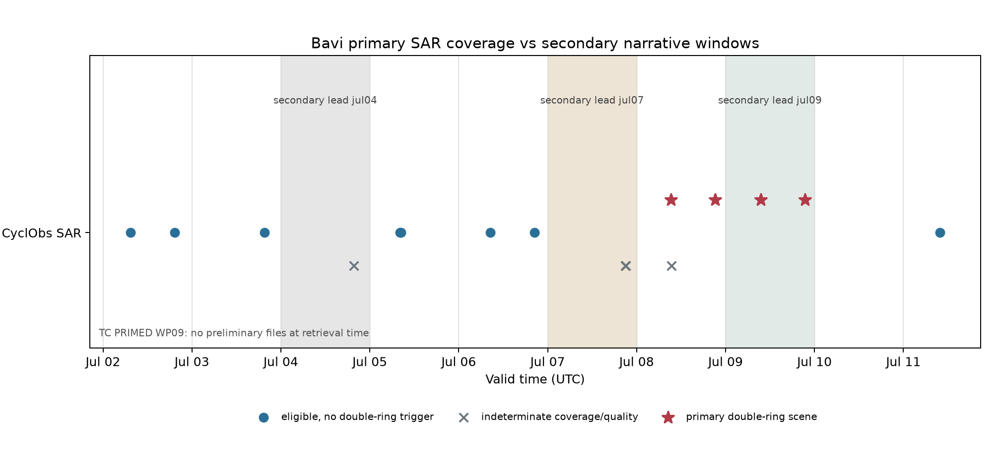

# C-结构：巴威一手微波覆盖与证据等级

状态：`primary-coverage-correction / research-evidence-audit`。协议见 [c-coverage-correction-protocol.md](docs/c-coverage-correction-protocol.md)。

## 这轮做成了什么

1. [MEASURED] **旧结论“巴威 3-4 次置换被当前数据否定”正式撤回。** 撤回依据来自 CyclObs 自身的结构覆盖不足；NASA/Wikipedia/CIMSS 文字不承担新真值。
2. [MEASURED] CyclObs 的一手裁决为：**7 月 8--9 日确证；7 月 4 日存疑；7 月 7 日存疑。**
3. [MEASURED] TC PRIMED 在 2026-07-15 12:50 UTC 的 `v01r01/preliminary/2026/WP/09/` 文件数为 0，裁决为**无覆盖**。
4. [MEASURED] 16 景 CyclObs SAR 的真实跨度为 2026-07-02 07:25 至 2026-07-11 09:52 UTC；12 景质量合格，4 景确认双环风结构。
5. [MEASURED] 二手叙述与一手结果已分栏保存；NASA SVS、Wikipedia 和 CIMSS 均从一手结构裁决中排除。



## 一手裁决

### CyclObs 逐时段格式

|可观测时段|裁决|一手依据|
|---|---|---|
|7 月 8--9 日|**确证**|质量合格双峰景连续出现；其间没有质量合格单峰景关闭区间|
|7 月 4 日|**存疑**|时间命中，眼区没有进入 SAR 获取范围|
|7 月 7 日|**存疑**|时间命中，中心质量和眼区门槛没有同时通过|

[MEASURED] 这些词描述可观测时段的证据等级，不转换成物理 ERC 次数。

### 确证时段的逐景正结构证据

|有效时刻 UTC|任务|中心位置|内/外峰半径 km|内/外 prominence m/s|景号缩写|
|---|---|---|---:|---:|---|
|07-08 09:19:41|RCM-1|17.18°N, 132.43°E|37 / 141|3.38 / 0.78|`rcm1...20260708t091941...`|
|07-08 21:14:23|RCM-1|17.89°N, 130.40°E|45 / 106|2.13 / 2.12|`rcm1...20260708t211423...`|
|07-09 09:26:47|RCM-1|18.85°N, 129.06°E|43 / 104|1.68 / 1.39|`rcm1...20260709t092647...`|
|07-09 21:27:40|Sentinel-1D|20.63°N, 127.76°E|37 / 123|1.37 / 0.97|`s1d...20260709t212740...`|

[MEASURED] 完整景号、源 URL、SHA-256 和逐径向廓线保存在 `cyclobs_scene_evidence.csv` 与原 CyclObs 审计 JSON。四景确证“该时刻存在双环轴对称风结构”。完整 ERC 的形成、收缩、内环消失和周期边界需要更密的连续微波证据。

### 存疑时段

|二手待核窗口|时间命中景|一手质量结果|裁决|
|---|---|---|---|
|7 月 4 日|07-04 19:39，12.72°N / 149.60°E|`eye_in_acquisition=false`|不可判定：眼区没有进入 SAR 获取范围|
|7 月 7 日|07-07 20:55，16.73°N / 134.82°E|眼区在场；中心质量 `2.0`，未满足 `<2`|不可判定：中心质量卡在阈值|
|7 月 7 日|07-07 21:06，17.03°N / 132.98°E|眼区缺失；中心质量 `3.2`|不可判定：空间与中心质量同时不合格|

[MEASURED] 7 月 4 日和 7 日均有**时间命中**，也均缺少可承担结构裁决的合格眼区景。对应物理 ERC 的发生与缺席在本数据源中保持不可判定。

### TC PRIMED

- [MEASURED] 查询前缀：`v01r01/preliminary/2026/WP/09/`。
- [MEASURED] 返回文件数：`0`；S3 响应 SHA-256：`a951283672c0101faffc36502f58b46be459839d1d0a3dbd96c71b9a6c386164`。
- [CITED] TC PRIMED v01r01 文档说明 preliminary 文件通常在热带气旋消散约一周后发布。因此当前零文件属于明确的资料时效边界。

TC PRIMED 在本次快照中的裁决为：7 月 4 日无覆盖；7 月 7 日无覆盖；7 月 9 日无覆盖。

## 二手旁证

|来源|它说了什么|本项目证据等级|
|---|---|---|
|[NASA SVS](https://svs.gsfc.nasa.gov/5662)|科普叙述把 7 月 4、7、9 日称为三次 ERC，并描述 7 月 10 日 GPM 双眼墙|[CITED] 二手叙述；原始轨道数据尚未由本项目独立复核|
|[Wikipedia](https://en.wikipedia.org/wiki/Typhoon_Bavi_%282026%29)|综合叙述三次 ERC|[CITED] 二级旁证|
|[CIMSS Satellite Blog](https://cimss.ssec.wisc.edu/satellite-blog/archives/71044)|提供 7 月 3-9 日高频卫星和环境背景|[CITED] 背景旁证；页面没有独立事件计数|

这些来源用于提出待核窗口。它们不进入一手结构裁决。

## 永久证据规则

> 一手观测能够确证景级结构，也能够给出不可判定。物理缺席需要先证明数据覆盖、采样密度和观测算子足以看见目标现象。二手叙述只提供待核线索。

[MEASURED] 本案例的三个窗口最大质量合格采样间隔均超过 6 小时，且当前双峰算子的 ERC 检出率尚未估计。三个窗口的 `sufficient_to_assert_physical_absence` 全部为 `false`。

## 三把刀

1. **状态向量。** 本轮没有动力状态；记录向量为 `(time,lat,lon,eye_coverage,center_quality,dual_peak,radii,prominence)`。
2. **参数与独立观测。** 拟合参数 0；16 景 CyclObs 是一手离散观测。三个日期窗来自二手叙述，只承担检索索引。
3. **证伪数据。** 逐景眼区和中心质量字段证伪旧数量外推；S3 WP09 清单证伪 TC PRIMED 当前覆盖；未来原始被动微波轨道可复核二手线索。

## 已经能用的东西

- `outputs/c_coverage_correction/bavi_erc_coverage_audit.json`：完整证据分层、逐景记录、窗口矩阵与 tally。
- `outputs/c_coverage_correction/cyclobs_scene_evidence.csv`：16 景一手证据表。
- `outputs/c_coverage_correction/narrative_window_coverage.csv`：三个二手待核窗口的覆盖审计。
- `outputs/c_coverage_correction/manifest.json`：全部输出的 SHA-256。

复现命令：

```bash
cd "/Users/taozhe/Documents/New project/typhoon"
markov/.venv/bin/python markov/scripts/audit_bavi_erc_coverage.py
PYTHONPATH=markov/src markov/.venv/bin/python -m unittest markov/tests/test_coverage.py -v
```

## 缺口与下一步

- TC PRIMED WP09 preliminary 上线后，需要读取原始 85-92 GHz 轨道并按眼区覆盖逐景复核。
- SAR 风双峰与微波降水双眼墙属于不同观测算子；二者的命中率和时间偏移需要历史公开案例估计。
- 当前一手资料支持 7 月 8--9 日“确证”裁决。巴威完整 ERC 周期数保持不可判定。
