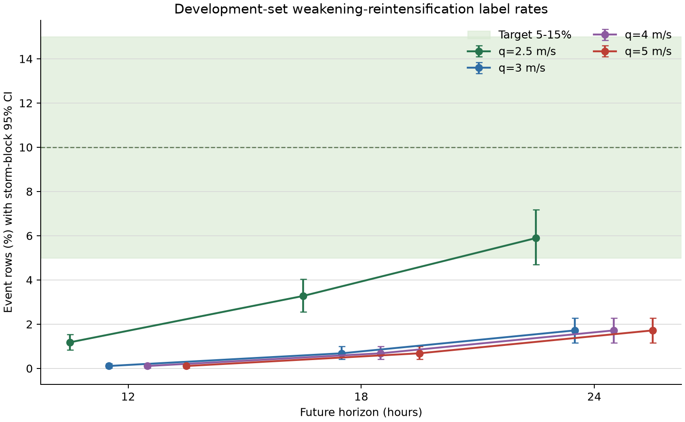
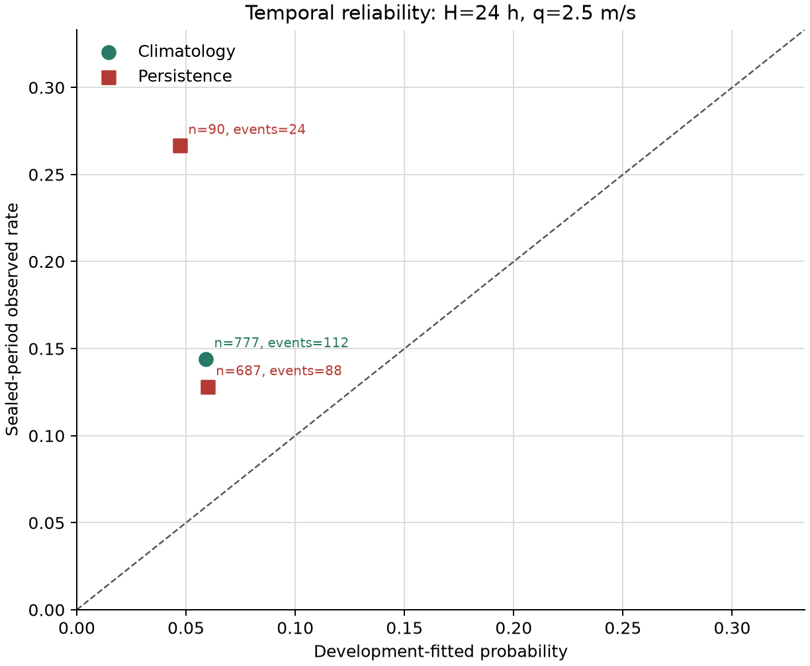

# C 支线：非退化减弱—再增强波形标签 v2

状态：`sealed-temporal-research-baseline`；资格：`unvalidated`。

## 这轮做成了什么

- [MEASURED] 确定性开发集选择得到 `H=24 h`、`q=2.5 m/s`；开发集目标率判据通过。
- [MEASURED] 开发集逐时次事件率 5.9% [4.7%, 7.2%]；2019--2024 密封时间段事件率 14.4% [9.9%, 19.4%]。
- [MEASURED] 密封时间段点估计比开发集高 8.5 个百分点；两个台风聚类 95% CI不重叠。开发集点估计通过 5% 门槛，其区间下界为 4.7%。
- [MEASURED] 密封时间段包含 112 个事件、777 行、70 场台风；双类别评分门槛通过。
- [MEASURED] 气候 Brier=0.1306 [0.0912, 0.1742]；持续性 Brier=0.1311 [0.0913, 0.1751]。
- [MEASURED] `Brier_persistence-Brier_climatology`=0.000489 [0.000001, 0.001125]；持续性基线被密封时间检验证伪。
- [MEASURED] 1 分钟 `USA_WIND` 中，5 kt 整倍数占 100.0%；12 个数值候选折叠成 6 个事件向量等价类，其中 3 类包含重复标签。
- [CITED+MEASURED] 5 kt 等于 2.572 m/s；选定的 `q=2.5 m/s` 在该量化序列上对应至少一个 5 kt 强度档。
- [MEASURED] 这个结果建立了一个可评分、可被后续方法击败的概率门槛。标签语义仍是强度波形代理；微波/SAR 结构承担 ERC 因果确认。

## 候选标签审计

[MEASURED] 比率括号为按台风 bootstrap 2,000 次的 95% CI。选择只使用 2001--2018；表中粗体行为冻结标签。

|H|q|行/台风|事件|开发率|目标内|向量哈希|
|---:|---:|---:|---:|---:|:---:|---|
|12 h|2.5|3645/252|43|1.2% [0.8%, 1.5%]|否|`ea7672b045`|
|12 h|3|3645/252|4|0.1% [0.0%, 0.2%]|否|`98db6e2467`|
|12 h|4|3645/252|4|0.1% [0.0%, 0.2%]|否|`98db6e2467`|
|12 h|5|3645/252|4|0.1% [0.0%, 0.2%]|否|`98db6e2467`|
|18 h|2.5|3512/245|115|3.3% [2.6%, 4.0%]|否|`568d7713a4`|
|18 h|3|3512/245|24|0.7% [0.4%, 1.0%]|否|`5fb9495ebc`|
|18 h|4|3512/245|24|0.7% [0.4%, 1.0%]|否|`5fb9495ebc`|
|18 h|5|3512/245|24|0.7% [0.4%, 1.0%]|否|`5fb9495ebc`|
|**24 h**|**2.5**|3376/241|199|5.9% [4.7%, 7.2%]|是|`93aff61cc9`|
|24 h|3|3376/241|58|1.7% [1.2%, 2.3%]|否|`7f1f9bf3cf`|
|24 h|4|3376/241|58|1.7% [1.2%, 2.3%]|否|`7f1f9bf3cf`|
|24 h|5|3376/241|58|1.7% [1.2%, 2.3%]|否|`7f1f9bf3cf`|

## 量化等价类

[MEASURED] 同一哈希代表开发集的行键和事件向量完全相同。数值阈值名称仍保留，统计证据按一个等价类计。

- `568d7713a466`：H=18h/q=2.5m/s。
- `5fb9495ebc04`：H=18h/q=3m/s, H=18h/q=4m/s, H=18h/q=5m/s。
- `7f1f9bf3cf5a`：H=24h/q=3m/s, H=24h/q=4m/s, H=24h/q=5m/s。
- `93aff61cc9b7`：H=24h/q=2.5m/s。
- `98db6e24671b`：H=12h/q=3m/s, H=12h/q=4m/s, H=12h/q=5m/s。
- `ea7672b04508`：H=12h/q=2.5m/s。

## 密封时间评分

- [ASSUMED+MEASURED] 开发集气候概率 `p=0.0591`；Jeffreys alpha=0.5。
- [MEASURED] 历史波形 `H_t=0`：`p=0.0599`，191/3197 事件/行。
- [MEASURED] 历史波形 `H_t=1`：`p=0.0472`，8/179 事件/行。
- [MEASURED] 持续性 Brier skill=-0.003742 [-0.006863, -0.000014]。
- [MEASURED] 全部区间按密封时间段台风 SID 整块重采样；相邻 6 h 行不充当独立样本。

## 三把刀自检

1. 状态向量：无动力状态；观测向量为九点 1 分钟 best-track 强度与未来海陆标记。
2. 参数与观测：标签含 2 个开发集离散超参数；气候/持续性基线含 1/2 个经验概率参数；密封评分的独立单位是台风。
3. 证伪数据：2019--2024 密封风暴的 Brier、可靠性、基准率漂移和台风聚类区间。

## 偏离清单

- [MEASURED] 无。样本、物理域、候选网格、排序、时间分区、概率和评分均在新标签率读取前冻结于 Git。

## 缺口与下一步

- 该标签测量 1 分钟 best-track 的强度谷形；ERC 结构原因仍未赋值。
- 5 kt 量化压缩了阈值自由度；更细强度观测或微波径向结构才能增加独立信息。
- 下一轮 ERC 概率实验应使用双人盲标的结构事件，沿用本报告的气候 Brier 门槛。

## 来源与复现

- [NOAA/NCEI IBTrACS](https://www.ncei.noaa.gov/products/international-best-track-archive)
- [MEASURED] 分析代码 Git `fb4e5e6dfd6eac9a14e72c0e397a326da6c66028`；生成时刻 `2026-07-15T13:22:40.332266+00:00`。
- 机器可读结果：`outputs/c_event_label_v2/benchmark.json`、`candidate_rates.csv`、`validation_rows.csv`、`validation_reliability.csv`、`manifest.json`。
