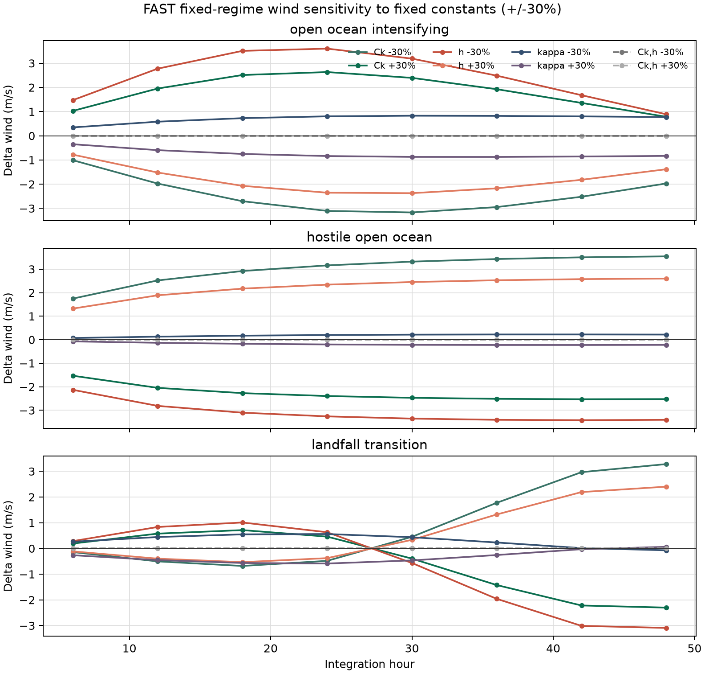

# FAST 固定常量全局敏感性审计

状态：`synthetic-structural-audit`；模型资格：`research-rejected`。预注册见 [global-sensitivity-protocol.md](docs/global-sensitivity-protocol.md)。

## 这轮做成了什么

1. [MEASURED] `Ck`、西北太平洋边界层深度 `h`、FAST `kappa` 已分别运行 `-30%/+30%`，覆盖开放海洋增强、恶劣海洋环境和登陆过渡三个冻结合成场景。
2. [MEASURED] `Ck` 与 `h` 联合同比缩放后的最大原生状态差为 `2.55e-11`，最大转移概率 L1 差为 `8.66e-16`，均低于预注册容差 `1e-8`。
3. [MEASURED] 当前 FAST 连续核心只识别组合量 `Ck/h`。`Ck` 与 `h` 作为两个独立常量进入校准会形成结构混淆，适合改写为一个组合量 `theta_FAST=Ck/h`，直至独立观测能够约束二者。
4. [MEASURED] 三个 regime 对风速路径的最大作用为 `0.0 m/s`。v0.1 的 `research-rejected` 判决再次得到独立代码路径复现。
5. [MEASURED] 完整 Markov 引擎中，连续扰动可触发一次离散 regime 分叉，并将 48 小时气压差放大到 `4.8 hPa`；连续物理响应与离散抽样响应已经分别输出。



## 冻结实验

- [CITED] 上游 [Lin et al. FAST 开源实现](https://github.com/linjonathan/tropical_cyclone_risk/tree/a540a1ed86b121f7244557edb691b40561b81939) 给出 `Ck=1.2e-3`、WP `h=1800 m`、`epsilon=0.33`、`kappa=0.10`；方法论文为 [Lin et al. (2023)](https://doi.org/10.1029/2023MS003686)。
- [ASSUMED] 每个场景积分 48 小时，每 6 小时更新一次强迫；场景、regime 日程、种子和全部扰动在查看结果前写入机器可读配置。
- [ASSUMED] 固定 regime 引擎隔离连续方程；完整 Markov 引擎使用未拟合 demo 参数并共享随机数。
- [MEASURED] 本轮估计参数数目为 0。所有输出是确定性的局部结构探针，因此不构造抽样置信区间。

## 固定 regime 主结果

[MEASURED] 表内数值是三个合成场景中的最大绝对变化；`Delta V48`、`Delta Pc48`、`Delta RMW48` 分别为 48 小时终值差。该表衡量模型对常量的局部依赖，单位不代表真实预报误差。

|扰动|最大 `|Delta V48|` m/s|最大 `|Delta Pc48|` hPa|最大 `|Delta RMW48|` km|轨迹最大 `|Delta V|` m/s|
|---|---:|---:|---:|---:|
|`Ck -30%`|3.54|1.54|13.66|3.54|
|`Ck +30%`|2.53|1.16|11.88|2.63|
|`h -30%`|3.41|1.58|16.49|3.60|
|`h +30%`|2.60|1.14|10.33|2.60|
|`kappa -30%`|0.77|0.20|0.70|0.83|
|`kappa +30%`|0.83|0.20|0.71|0.87|
|`Ck,h -30%`|0.00|0.00|0.00|0.00|
|`Ck,h +30%`|0.00|0.00|0.00|0.00|

在模型方程中，风速与核心湿度趋势的前因子为

```text
0.5 * Ck * surface_exchange_multiplier / h
```

[MEASURED] `Ck` 与 `h` 联合同比缩放保持该前因子不变，完整轨迹也在浮点精度内保持不变。初始化式使用倒数组合 `h/Ck`，因此同一结构混淆贯穿初始化和积分。

## 完整 Markov 响应

- [MEASURED] 风速与 RMW 的敏感性和固定 regime 引擎相同，因为 regime 当前只进入气压柱速度项。
- [MEASURED] `Ck +30%` 和 `h -30%` 各触发最多 1 个 regime 不同的积分步；对应最大转移概率 L1 差为 `1.12` 和 `1.13`。
- [MEASURED] 离散分叉后的最大 48 小时气压差分别为 `4.63 hPa` 和 `4.79 hPa`。固定 regime 下对应值为 `1.16 hPa` 和 `1.58 hPa`。
- [MEASURED] `kappa +/-30%` 未触发 regime 分叉，完整引擎最大气压差为 `0.09 hPa`。

这些气压差同时包含连续状态改变和共享随机数下的离散路径分叉。它们属于合成结构响应，业务不确定性仍需现实回报样本估计。

## 三把刀

1. **状态向量里有什么？** `X=(V,m,Pc,RMW)`；完整引擎另含三态 `Z`。结构审计确认 `Z` 对 `V` 的作用恒为 0。
2. **参数几个、独立观测几个？** 本轮拟合参数为 0；三个引用常量承担敏感性扰动。`Ck` 与 `h` 在方程中只形成一个可识别组合量。三个合成场景承担数值探针，现实独立观测数为 0。
3. **拿什么证伪？** 比值保持扰动已检验结构恒等性；现实风速、气压与 RMW 的密封回报负责检验性能。当前实验只支持结构判决。

## 预注册偏离

[MEASURED] 无。三个场景、八个扰动、两个引擎、阈值和汇总规则均按冻结配置执行。

## 已经能用的东西

- `config/global_sensitivity.json`：全部引用、场景、扰动、种子和容差。
- `src/typhoon_markov/sensitivity.py`：固定 regime 与完整 Markov 的统一敏感性运行器。
- `outputs/global_sensitivity/global_sensitivity.json`：逐步轨迹、瞬时趋势、结构判据和跨场景汇总。
- `outputs/global_sensitivity/global_sensitivity_summary.csv`：48 行场景级比较表。
- `outputs/global_sensitivity/manifest.json`：结果文件 SHA-256。

复现命令：

```bash
cd "/Users/taozhe/Documents/New project/typhoon"
markov/.venv/bin/python markov/scripts/run_global_sensitivity.py
PYTHONPATH=markov/src markov/.venv/bin/python -m unittest discover -s markov/tests -v
```

## 缺口与下一步

- 这三个场景是合成探针，覆盖范围无法替代真实风暴分组回报检验。
- `Ck` 与 `h` 需要独立边界层或通量观测才能拆分估计；当前实现应使用 `theta_FAST=Ck/h` 暴露可识别自由度。
- regime 需要通过显式耦合项进入风速条件分布，并在新增独立结构观测后重新计算参数预算。
- v0.1 保持 `research-rejected`；本报告提供可复现的失败结构与量级审计。
