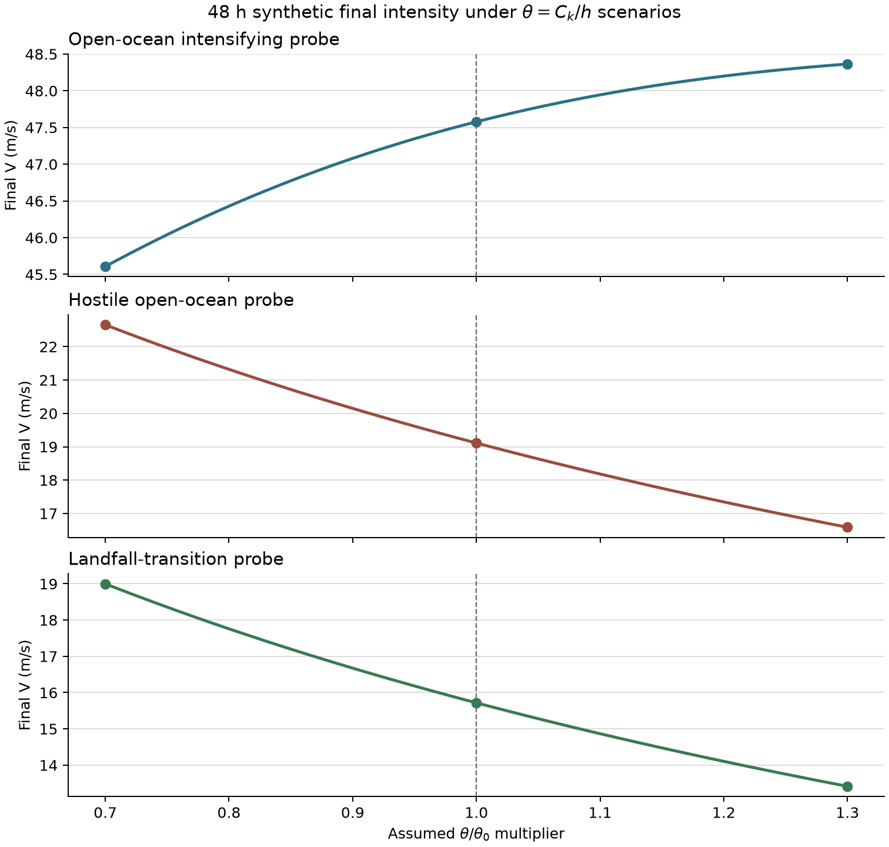

# `theta=Ck/h` 到 48 小时终值的传播

状态：`synthetic-structural-sensitivity`；资格：`unvalidated`。

## 这轮做成了什么

- [CITED] 基准 `Ck=1.2e-3`、`h=1800 m`，因此 `theta_0=6.667e-07 m^-1`。
- [ASSUMED] `theta/theta_0` 采用 `[0.7,1.3]` 的 61 点有界情景；它是 scenario envelope，没有概率分布语义。
- [MEASURED] 三个合成场景的最大基准中心 48 h `abs(delta V)` 为 `3.54 m/s`；最大端点到端点宽度为 `6.07 m/s`。
- [MEASURED] `Ck` 缩放与等价 `h` 反向缩放的完整轨迹最大原生状态差 `3.553e-15`，结构不变性通过。
- [MEASURED] 机构统一风窗后的成对强度分歧为 `2--6 m/s`；本合成探针的最大单侧变化 3.54 m/s 位于同一数量级。两者来源和统计语义不同。
- [MEASURED] 这些终值界定 v0.1 对一个假定常量范围的结构敏感度；台风强度预报资格仍为 `unvalidated`。

## 场景终值

[MEASURED] 风速单位 m/s。`max abs delta` 以基准 `theta_0` 为中心；`width` 是 61 点最小到最大终值范围。

|合成场景|初始 V|0.7 theta0 终值|theta0 终值|1.3 theta0 终值|max abs delta|width|单调性|
|---|---:|---:|---:|---:|---:|---:|---|
|`open_ocean_intensifying`|35.00|45.61|47.58|48.36|1.97|2.76|nondecreasing|
|`hostile_open_ocean`|45.00|22.65|19.11|16.59|3.54|6.07|nonincreasing|
|`landfall_transition`|42.00|19.00|15.72|13.42|3.28|5.58|nonincreasing|

## 结构解释

[MEASURED] FAST 的风速与水汽倾向前因子为 `0.5*Ck/h`。`Ck` 与 `h` 同比缩放的轨迹保持不变，说明当前实现只识别一个组合 `theta`；二者分解存在 1 个不可识别自由度。

[ASSUMED] `+/-30%` 由项目作为压力测试边界指定。文献提供基准常量；该区间的概率分布语义为空。因此 3.54 m/s 属于合成模型响应，95% 误差语义与机构分歧的方差相加资格均为零。

## 三把刀自检

1. 状态向量：`X=(V,m,Pc,RMW)`；固定 regime 只作为已知日程。
2. 参数与观测：拟合参数 0；扫描 1 个可识别组合；三个场景属于合成强迫序列。
3. 证伪数据：两种参数化的完整轨迹和 61 点终值；真实预报能力仍由独立登陆真值与密封回报评分。

## 偏离清单

- [MEASURED] 无。场景、网格、引擎和终值定义均在专用网格运行前冻结。

## 缺口与下一步

- 区间宽度由假定 `+/-30%` 边界决定；现实常量不确定性尚未形成概率分布。
- 三个强迫序列是合成探针；真实登陆误差仍缺少独立测站真值。
- v0.1 regime 对风速路径的作用为 0，本报告保留固定日程以隔离该失败结构。

## 来源与复现

- [Lin et al. (2023), JAMES](https://doi.org/10.1029/2023MS003686)
- [MEASURED] 分析代码 Git `0f343298449b7095403c937cb60d31fbca46990f`；生成时刻 `2026-07-15T14:04:38.185236+00:00`。
- 机器可读结果：`outputs/theta_propagation/theta_propagation.json`、`theta_grid.csv`、`manifest.json`。
