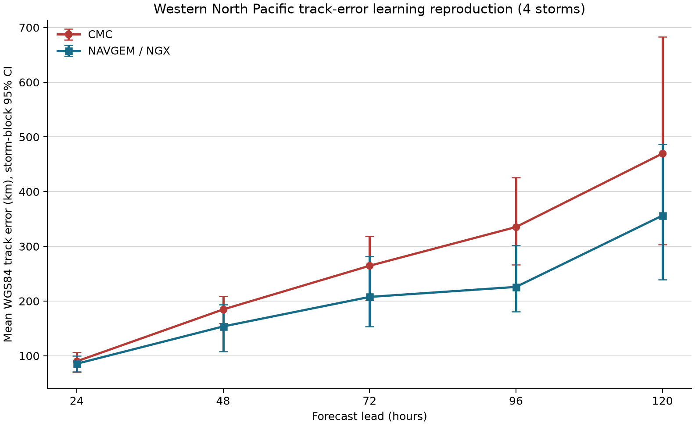

# A 支线路径学习性复现

状态：`learning-reproduction`。

## 这轮做成了什么

- [MEASURED] 已复现 163 个严格配对的模式循环/时效案例，覆盖 4 个台风。
- [CITED] 两条业务模式路径分别为加拿大模式 `CMC` 与 NAVGEM/NOGAPS `NGX`；预报来自 UCAR ATCF a-deck，验证位置来自 IBTrACS `USA_LAT/USA_LON`。
- [MEASURED] 图和表均使用相同案例配对，置信区间以台风为 block；记录数没有当作独立样本数。
- [MEASURED] 我的对比显示，在4个历史台风的严格配对样本中，NGX在5/5个预报时效上的平均路径误差较低；样本量与台风聚类区间决定这一结果只属于学习性复现。

## 误差表

[MEASURED] 单位为 km；括号为台风 block bootstrap 95% CI。

|时效|模式|记录/台风|平均误差|中位误差|P80|
|---:|---|---:|---:|---:|---:|
|24 h|CMC|46/4|90 (70--107)|85 (63--102)|118|
|24 h|NGX|46/4|85 (71--100)|71 (64--98)|119|
|48 h|CMC|40/4|185 (159--209)|200 (154--220)|252|
|48 h|NGX|40/4|154 (108--193)|115 (94--188)|213|
|72 h|CMC|34/4|265 (202--319)|243 (166--285)|325|
|72 h|NGX|34/4|208 (153--282)|166 (96--172)|261|
|96 h|CMC|25/4|335 (266--426)|326 (244--440)|474|
|96 h|NGX|25/4|226 (181--302)|164 (150--191)|329|
|120 h|CMC|18/4|470 (303--683)|441 (266--590)|630|
|120 h|NGX|18/4|356 (240--487)|282 (189--374)|510|

## 三把刀自检

1. 状态向量：每个模式在有效时刻的 `X=(latitude, longitude)`；本轮没有自研路径状态或动力方程。
2. 参数与观测：拟合参数为 0；输入是两套业务模式位置，验证通道是事后最佳路径位置。两套模式误差不宣称独立。
3. 证伪数据：同一风暴、循环和有效时刻的 IBTrACS `USA_LAT/USA_LON`，以 WGS84 测地距离评分。

## 来源与口径

- [MEASURED] 数据运行时间：`2026-07-15T10:52:47.459523+00:00`。
- [CITED] a-deck 保存模式预报全历史；本轮读取 `CMC/NGX` 的24、48、72、96、120小时时效。
- [CITED] IBTrACS 提供事后统一的 JTWC/USA 位置字段；该位置仍是分析估计，缺少逐点独立位置真值误差。
- [ASSUMED] 历史 a-deck 缺少每条产品的真实公开时间，本轮按模式循环归档评分，资格标签保持 `learning-reproduction`。

## 缺口与下一步

- 当前只有4个预先指定台风，结论尚不能代表整个西北太平洋季节或长期模式水平。
- `CMC/NGX` 属于 late guidance；下一步需要保存真实 `available_at` 才能完成前瞻业务时效审计。
- 最佳路径中心缺少独立逐点测量误差；报告衡量相对事后分析的位置误差。
- 下一步按冻结的全样本预注册扩展到2022--2024全部命名风暴，同时继续保留本轮4台风结果。
