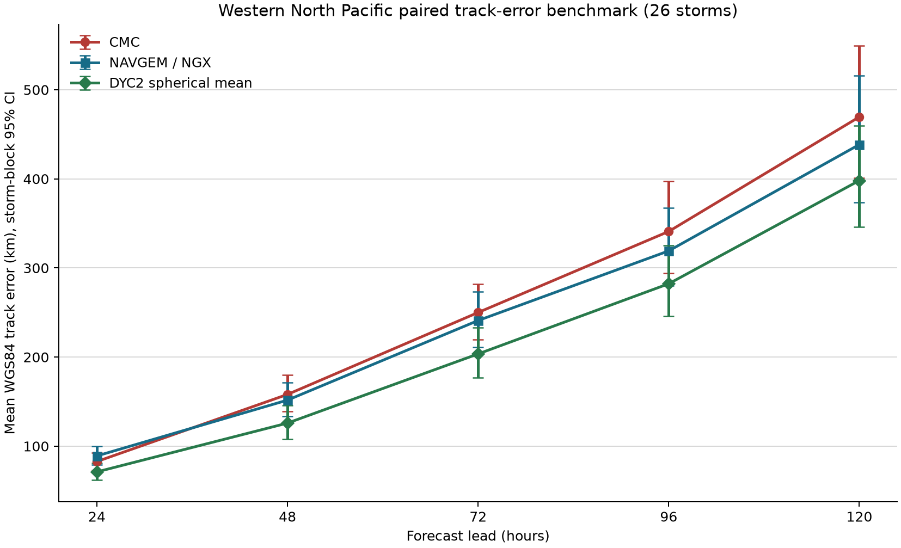

# A 支线路径对比：可发布学习性复现

> **来源审计修正（2026-07-15）：** `DYC2` 是本项目对 `CMC/NGX` 做固定 0.5/0.5
> 球面平均得到的本地诊断量，官方 a-deck 中没有该 TECH。其正式名称现为
> `LOCAL_EQ2_CMC_NGX`；本报告保留旧标签以维持历史输出可复现。详见
> [DYC2 来源审计](dyc2_source_audit.md)。

状态：`prospective-expanded-sample-learning-reproduction`。资格：`unvalidated`。

## 这轮做成了什么

- [MEASURED] 按冻结规则从 27 个强台风候选中机械纳入 26 个台风，生成 1203 个严格同样本案例；覆盖审计的 exact-time 配对计数为 1203。
- [MEASURED] 三条路径使用完全相同的风暴、循环、有效时刻和 best-track 位置；DYC2 是 0.5/0.5 单位球向量平均，拟合参数为 0。
- [MEASURED] 我的对比显示，DYC2 在 5/5 个时效低于当时效最佳单模，其中 4/5 个配对差的台风聚类 95% CI 完全低于 0。
- [ASSUMED+MEASURED] lead-centered Pearson `rho=0.36` (95% CI [0.23, 0.49])，交换相关公式得到 `n_eff=1.47` (95% CI [1.34, 1.62])。这两套路径仍提供多于一个有效独立意见，数值依赖交换相关假设。
- [MEASURED] 80% 经验半径在 0/5 个时效的台风聚类 95% CI 排除目标 0.80。
- [MEASURED] 留一台风交叉验证已为 DYC2 生成 50/80/95% 经验半径与真实覆盖率；训练与检验按整场台风分离。

## 配对路径误差

[MEASURED] 单位 km；括号为按台风 block bootstrap 2,000 次的 95% CI。

|时效|路径|记录/台风|平均误差|中位误差|P80|
|---:|---|---:|---:|---:|---:|
|24 h|CMC|328/26|83 [73, 93]|70 [61, 84]|118|
|24 h|DYC2|328/26|71 [62, 81]|56 [46, 68]|106|
|24 h|NGX|328/26|89 [79, 100]|76 [67, 85]|137|
|48 h|CMC|284/26|158 [139, 180]|138 [123, 160]|231|
|48 h|DYC2|284/26|126 [108, 146]|100 [87, 119]|177|
|48 h|NGX|284/26|152 [134, 172]|124 [112, 139]|224|
|72 h|CMC|242/26|250 [219, 282]|224 [193, 253]|344|
|72 h|DYC2|242/26|204 [177, 233]|156 [142, 185]|295|
|72 h|NGX|242/26|241 [211, 273]|196 [167, 225]|349|
|96 h|CMC|196/25|341 [294, 397]|300 [255, 354]|496|
|96 h|DYC2|196/25|282 [246, 325]|220 [200, 260]|409|
|96 h|NGX|196/25|319 [280, 368]|259 [221, 293]|467|
|120 h|CMC|153/23|470 [401, 549]|438 [348, 506]|640|
|120 h|DYC2|153/23|398 [346, 460]|336 [267, 391]|571|
|120 h|NGX|153/23|439 [373, 516]|372 [285, 460]|645|

## 共识配对差

[MEASURED] `DYC2 - 单模`；负值表示共识误差较小。

|时效|对比|平均差 km|95% CI|
|---:|---|---:|---:|
|24 h|DYC2_MINUS_CMC|-12|[-17, -7]|
|24 h|DYC2_MINUS_NGX|-18|[-24, -13]|
|48 h|DYC2_MINUS_CMC|-32|[-45, -20]|
|48 h|DYC2_MINUS_NGX|-26|[-39, -14]|
|72 h|DYC2_MINUS_CMC|-46|[-71, -24]|
|72 h|DYC2_MINUS_NGX|-37|[-60, -18]|
|96 h|DYC2_MINUS_CMC|-59|[-92, -23]|
|96 h|DYC2_MINUS_NGX|-37|[-69, -10]|
|120 h|DYC2_MINUS_CMC|-71|[-119, -14]|
|120 h|DYC2_MINUS_NGX|-40|[-93, 7]|

## 模式相关与 n_eff

[ASSUMED] `n_eff=2/(1+rho)` 假定两个来源可用一个交换相关系数描述。[MEASURED] 主结果先分别移除每个 TECH 在各提前量的平均误差，降低共同的误差增长曲线对相关性的机械抬升。

- lead-centered Pearson: `rho=0.36` (95% CI [0.23, 0.49])；`n_eff=1.47` (95% CI [1.34, 1.62])。
- 原始径向误差敏感性: `rho=0.56` (95% CI [0.47, 0.66])；`n_eff=1.28` (95% CI [1.21, 1.36])。
- [CITED] NGX 是 NAVGEM/NOGAPS 路径配 GFS tracker；tracker 共享不能解释为共享 GFS 动力核心。CMC 与 Navy 模式动力本体不同，共同资料与追踪仍会相关。
- 这个数字衡量误差一致性，不衡量准确性，也不证明两个动力系统的结构独立。

## 交叉验证不确定性

[MEASURED] 表中半径来自留一台风训练折；覆盖率 CI 继续按台风聚类。

|时效|目标覆盖|训练台风/折|中位半径 km|实际覆盖|95% CI|
|---:|---:|---:|---:|---:|---:|
|24 h|50%|25|56|51%|43--60%|
|24 h|80%|25|106|80%|73--86%|
|24 h|95%|25|177|94%|89--98%|
|48 h|50%|25|100|50%|41--58%|
|48 h|80%|25|178|80%|72--88%|
|48 h|95%|25|325|94%|88--98%|
|72 h|50%|25|156|50%|43--58%|
|72 h|80%|25|296|81%|72--88%|
|72 h|95%|25|527|94%|90--98%|
|96 h|50%|24|220|50%|42--59%|
|96 h|80%|24|411|80%|71--87%|
|96 h|95%|24|749|94%|90--98%|
|120 h|50%|22|336|49%|38--60%|
|120 h|80%|22|576|80%|70--88%|
|120 h|95%|22|987|94%|90--98%|

## 资格、TECH 与来源

- [MEASURED] WP 正式编号风暴 75 个；CMA 峰值缺测 1 个；强台风候选 27 个；最终纳入 26 个。
- [MEASURED] 覆盖排除：WP202024；排除原因是没有 CMC/NGX 同循环 72 h 路径，资格生成器未读取误差。
- [CITED] `CMC/NGX` 均为原始 late-cycle TECH；本轮读取原生 6 h 倍数点。UCAR 约定末尾 `I` 才表示提前对齐版本，本轮没有读取该版本。
- [MEASURED] 所有 a-deck、IBTrACS 与资格 manifest 的 SHA-256 在 provenance 中逐项核对；哈希漂移会中止运行。
- [MEASURED] 运行时刻 `2026-07-15T11:13:02.343877+00:00`；Git `52199e35b9afcecce7cc2afc5b5539800277f6f4`。

## 三把刀自检

1. 状态向量：每个有效时刻 `X=(latitude, longitude)`；DYC2 是两个位置的固定球面函数。
2. 参数与观测：拟合参数 0；两个相关模式位置输入、一个事后 best-track 验证通道；lead-centered `n_eff` 显式量化相关性。
3. 证伪数据：同风暴、同循环、同有效时刻的 IBTrACS `USA_LAT/USA_LON`，以 WGS84 测地距离、配对差和留一台风覆盖率评分。

## 缺口与下一步

- 历史 a-deck 缺少逐产品真实公开时刻；本报告复现模式循环，资格保持`learning-reproduction` 与 `unvalidated`。
- IBTrACS USA 位置是事后分析中心，逐点独立位置测量误差仍不可得。
- 两套模式共享观测生态和追踪方法；`n_eff` 依赖交换相关假设，原始相关敏感性已并列。
- 下一步扩展模式集合与年份，并保存真实 `available_at` 后开展前瞻业务检验。

## 引用

- [UCAR Tropical Cyclone Guidance Project](https://hurricanes.ral.ucar.edu/repository/)
- [UCAR early/late and interpolated TECH convention](https://hurricanes.ral.ucar.edu/guide/)
- [NHC forecast-aid definitions](https://www.nhc.noaa.gov/verification/verify6.shtml)
- [NOAA/NCEI IBTrACS](https://www.ncei.noaa.gov/products/international-best-track-archive)
