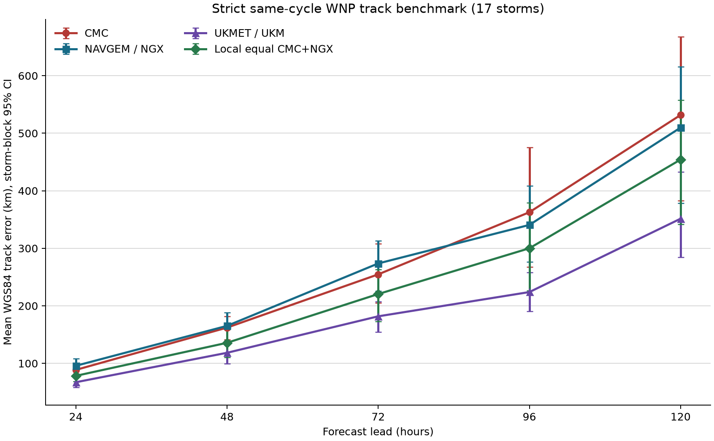

# A 支线深化：本地共识与 UKMET 独立核心复验

状态：`prospective-independent-core-learning-reproduction`；资格：`unvalidated`。

## 这轮做成了什么

- [MEASURED] `DYC2` 来源已经定案：它是本地 `CMC/NGX` 固定等权球面共识，正式名称为 `LOCAL_EQ2_CMC_NGX`，原始 a-deck TECH 计数为 0。
- [MEASURED] 严格三方同循环、同提前量、同有效时刻样本包含 552 条记录、17 场台风，覆盖季节为 2022, 2024。
- [ASSUMED+MEASURED] 本地共识与 UKM 的 lead-centered Pearson `rho=0.35` (95% CI [0.13, 0.53])，交换相关公式得到 `n_eff=1.49` (95% CI [1.31, 1.77])；未达到预注册的“接近 2”判据。
- [MEASURED] 同样本 `Delta n_eff=0.07` (95% CI [-0.20, 0.40])；当前样本无法分辨独立 UKMET 核心带来的有效意见增量。
- [MEASURED] 我的对比显示：独立 UKMET 核心与本地 CMC/NGX 共识的误差相关对应 `n_eff=1.49`，预注册的“接近 2”结论为未支持。

## 路径误差

[MEASURED] 单位 km；括号为台风 block bootstrap 2,000 次的 95% CI。四条路径使用完全相同案例。

|时效|路径|记录/台风|平均误差|中位误差|P80|
|---:|---|---:|---:|---:|---:|
|24 h|CMC|163/17|89 [80, 97]|78 [66, 91]|125|
|24 h|NGX|163/17|96 [82, 108]|83 [69, 91]|150|
|24 h|UKM|163/17|67 [58, 77]|53 [46, 58]|95|
|24 h|LOCAL_EQ2_CMC_NGX|163/17|78 [69, 89]|67 [52, 80]|117|
|48 h|CMC|137/17|162 [141, 182]|145 [129, 181]|231|
|48 h|NGX|137/17|165 [139, 188]|126 [103, 146]|253|
|48 h|UKM|137/17|118 [100, 136]|97 [80, 115]|183|
|48 h|LOCAL_EQ2_CMC_NGX|137/17|136 [110, 159]|105 [84, 144]|204|
|72 h|CMC|111/17|255 [205, 308]|243 [171, 268]|376|
|72 h|NGX|111/17|274 [226, 313]|218 [166, 262]|395|
|72 h|UKM|111/17|182 [155, 207]|133 [108, 177]|262|
|72 h|LOCAL_EQ2_CMC_NGX|111/17|221 [173, 263]|154 [139, 221]|324|
|96 h|CMC|82/15|363 [268, 475]|327 [224, 476]|528|
|96 h|NGX|82/15|341 [277, 408]|269 [192, 349]|466|
|96 h|UKM|82/15|224 [190, 258]|198 [155, 256]|304|
|96 h|LOCAL_EQ2_CMC_NGX|82/15|300 [226, 379]|222 [166, 338]|465|
|120 h|CMC|59/14|532 [383, 668]|457 [293, 619]|755|
|120 h|NGX|59/14|510 [378, 616]|456 [242, 518]|710|
|120 h|UKM|59/14|352 [285, 433]|328 [275, 380]|541|
|120 h|LOCAL_EQ2_CMC_NGX|59/14|454 [342, 558]|347 [246, 513]|691|

## 本地共识与 UKM 配对差

[MEASURED] `LOCAL_EQ2_CMC_NGX - UKM`；负值表示本地共识径向误差较小。

|时效|平均差 km|95% CI|
|---:|---:|---:|
|24 h|11|[3, 19]|
|48 h|17|[-1, 35]|
|72 h|39|[-5, 78]|
|96 h|76|[-3, 158]|
|120 h|103|[-31, 219]|

## 相关与有效意见数

[ASSUMED] `n_eff=2/(1+rho)` 使用可交换两误差流假设。[MEASURED] 主结果按提前量去均值，并在同一台风 bootstrap 样本中同步比较两组相关。这个数字衡量误差一致性，不衡量准确性，也不证明完全动力独立。

|量|CMC vs NGX|LOCAL_EQ2 vs UKM|差值|
|---|---:|---:|---:|
|lead-centered rho|0.42 [0.26, 0.58]|0.35 [0.13, 0.53]|NA|
|n_eff|1.41 [1.26, 1.58]|1.49 [1.31, 1.77]|0.07 [-0.20, 0.40]|
|raw Pearson rho|0.60 [0.47, 0.74]|0.55 [0.40, 0.69]|NA|
|lead-centered Spearman rho|0.42 [0.24, 0.54]|0.32 [0.16, 0.44]|NA|

## 覆盖与缺测

- [MEASURED] `tau=72 h` 三方同循环覆盖台风数：2022 年 7、2023 年 0、2024 年 10。2023 年形成整年结构性缺测。
- [MEASURED] 预注册证据门槛未达时效：无。
- [CITED] UCAR 将 `UKM` 标为 UK Met Office model using the development tracker，并说明 tracker 输出没有主观质控。
- [CITED] UKMET 模式本体采用 Met Office Unified Model 独立动力核心。共同观测、资料同化和后处理仍可产生相关误差。

## 三把刀自检

1. 状态向量：每个有效时刻 `X=(latitude, longitude)`；本地共识是两个位置的固定球面函数。
2. 参数与观测：拟合参数 0；三套业务模式位置输入、一个事后 best-track 验证通道；相关区间按整场台风重采样。
3. 证伪数据：同风暴、同循环、同有效时刻的 IBTrACS USA best track；预注册判据由径向误差相关、`Delta n_eff` 和证据门槛共同执行。

## 偏离清单

- [MEASURED] 无。TECH、17 场资格名单、时效、统计量、bootstrap 和判据均在读取 UKM 误差前冻结于 Git 提交。

## 缺口与下一步

- 2023 年 UKM 缺测限制年代代表性；本轮结论只覆盖归档中存在 UKM 的严格样本。
- UKM 使用 development tracker，缺少主观质控；模式核心独立与业务误差独立属于两个层级。
- 事后 best track 仍含分析不确定性；本轮是学习性复现，不声称任何超越。

## 来源与复现

- [UCAR late-cycle TECH definitions](https://verif.rap.ucar.edu/jntweb/hurricanes-beta/guide/late/)
- [ATCF System Administrator Guide](https://science.nrlmry.navy.mil/atcf/docs/html/ATCF_SAG_Sec3.html)
- [Met Office Unified Model](https://www.metoffice.gov.uk/research/approach/modelling-systems/unified-model)
- [NOAA/NCEI IBTrACS](https://www.ncei.noaa.gov/products/international-best-track-archive)
- [MEASURED] 分析代码 Git `08e6f7ddb9a70db038a27fcdfa9c2f93705bd127`；生成时刻 `2026-07-15T13:09:33.779677+00:00`。
- 机器可读结果：`outputs/round_v3/summary.json`、`outputs/round_v3/correlation_neff.json`、`outputs/round_v3/coverage_audit.csv`、`outputs/round_v3/paired_track_rows.csv`、`outputs/round_v3/provenance.json`。
